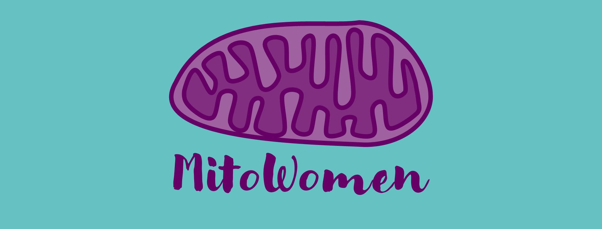

```{r out.width='100%', out.height='300px', echo=FALSE, fig.align='center'}

```

<br>

We are two mito-scientists, who inspired by others such as [#500WomenScientist](https://500womenscientists.org/), [#WomeninMalaria](https://womeninmalaria.weebly.com/), [#WomeninSoilScience](https://franciskadevries.wordpress.com/women-in-soil-science/) or [#Womenin Microbiology](https://microbiomedigest.com/sample-page/women-in-microbiology-for-keynote-lectures/), decided to start a platform to make the **women working in the mitochondrial field more visible**. 

With this initiative, we have the aim to contribute to accelerating **equality and diversity** in the mitochondrial field. This database intends not only to create a network for collaboration and support but also to **boost women representation** on editorial boards, as keynote speakers in conferences, in invited special issues, as reviewers, on grant funding panels or as expert researchers for media consultation or interviews.

We are firmly convinced that **diversity positively impacts science**. For this reason, with this initiative, we aim not only to give visibility to the women who work in the mitochondrial field but also to be a platform where **mitowomen from all over the world have the opportunity to be represented**.
